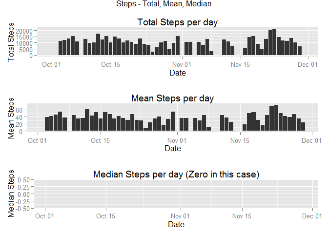

# Reproducible Research: Peer Assessment 1


## Loading and preprocessing the data


```r
library("dplyr")
```

```
## 
## Attaching package: 'dplyr'
## 
## The following object is masked from 'package:stats':
## 
##     filter
## 
## The following objects are masked from 'package:base':
## 
##     intersect, setdiff, setequal, union
```

```r
unzip("activity.zip")
activity = read.csv("activity.csv")
activity$date = as.Date(activity$date)
activity=tbl_df(activity)
```

## What is mean total number of steps taken per day?


```r
activityGroupDt  <- activity %>%  group_by(date) %>% summarize(total_steps = sum(steps, na.rm=TRUE), mean_steps = mean(steps, na.rm=TRUE), median_steps = median(steps, na.rm=TRUE)) 

library("ggplot2")
```

```
## Warning: package 'ggplot2' was built under R version 3.1.2
```

```r
#install.packages("gridExtra")
library(gridExtra)
```

```
## Warning: package 'gridExtra' was built under R version 3.1.3
```

```
## Loading required package: grid
```

```r
p1 <- qplot(activityGroupDt$date, activityGroupDt$total_steps,data=activityGroupDt, main="Total Steps per day", xlab="Date", ylab = "Total Steps", stat="identity", geom="histogram")
p2 = qplot(activityGroupDt$date, activityGroupDt$mean_steps,data=activityGroupDt, main="Mean Steps per day", xlab="Date",ylab = "Mean Steps", stat="identity", geom="histogram")
p3 = qplot(activityGroupDt$date, activityGroupDt$median_steps,data=activityGroupDt, main="Median Steps per day (Zero in this case)", xlab="Date",ylab = "Median Steps", stat="identity", geom="histogram")
grid.arrange(p1, p2, p3, nrow = 3, main = "Steps - Total, Mean, Median")
```

```
## Warning: Removed 8 rows containing missing values (position_stack).
```

```
## Warning: Removed 8 rows containing missing values (position_stack).
```

 


## What is the average daily activity pattern?

```r
activityGroupInt  <- activity %>%  group_by(interval) %>% summarize(total_steps = sum(steps, na.rm=TRUE), mean_steps = mean(steps, na.rm=TRUE), median_steps = median(steps, na.rm=TRUE)) 
qplot(activityGroupInt$interval, activityGroupInt$mean_steps, data=activityGroupInt, main="Mean Steps per day", xlab="Interval", ylab = "Mean Steps", stat="identity") +geom_line()
```

 

```r
activityMax  <- activity %>%  group_by(interval) %>% summarize(mean_steps = mean(steps, na.rm=TRUE)) %>%  arrange(desc(mean_steps))
max1 <- activityMax[1]$interval
#class(max1[1][1])
```
  
The maximum no. of average steps is on **835**


## Imputing missing values

### Total missing values

```r
missingValues = activity %>% filter(is.na(steps))
missingValuesCount = missingValues %>% count(steps)
countNA = missingValuesCount$n
```
The total missing Values in the activity dataset is **2304**

### Filling in all of the missing values with overall median (zero)

```r
activityNAFilled = merge(activity, activityGroupDt, by.x="date", by.y="date", all.x=TRUE, sort=FALSE)
activityNAFilled = activityNAFilled %>% mutate(steps = ifelse(is.na(steps),0, steps))  #round(mean_steps,digits=0))
```

### Make a histogram of the total number of steps taken each day (with filled in dataset)

```r
activityGroupDt  <- activityNAFilled %>%  group_by(date) %>% summarize(total_steps = sum(steps, na.rm=TRUE), mean_steps = mean(steps, na.rm=TRUE), median_steps = median(steps, na.rm=TRUE)) 

p11 <- qplot(activityGroupDt$date, activityGroupDt$total_steps,data=activityGroupDt, main="Total Steps per day", xlab="Date", ylab = "Total Steps - NA", stat="identity", geom="histogram")
p21 = qplot(activityGroupDt$date, activityGroupDt$mean_steps,data=activityGroupDt, main="Mean Steps per day", xlab="Date",ylab = "Mean Steps - NA", stat="identity", geom="histogram")
p31 = qplot(activityGroupDt$date, activityGroupDt$median_steps,data=activityGroupDt, main="Median Steps per day (Zero in this case)", xlab="Date",ylab = "Median Steps - NA", stat="identity", geom="histogram")
grid.arrange(p1, p11, p2, p21, p3, p31, ncol = 2, nrow = 3, main = "Steps - Total, Mean, Median")
```

 


## Are there differences in activity patterns between weekdays and weekends? (with filled in dataset)

### Create a dataset with weekflag which indicates "Weekend" or "Weekday""


```r
activityWeek <- activityNAFilled %>% mutate(weekflag = ifelse(weekdays(date)=="Saturday" | weekdays(date)=="Sunday", "Weekend","Weekday"))
activityWeekGroupDt  <- activityWeek %>%  group_by(interval,weekflag) %>% summarize(total_steps = sum(steps, na.rm=TRUE), mean_steps = mean(steps, na.rm=TRUE), median_steps = median(steps, na.rm=TRUE)) 
```

### Create a plot facet with weekflag accross mean steps


```r
qplot(activityWeekGroupDt$interval, activityWeekGroupDt$mean_steps,data=activityWeekGroupDt, main="Mean Steps per interval", xlab="Interval",ylab = "Mean Steps - NA", stat="identity", facets = weekflag~., geom = "line")
```

 

